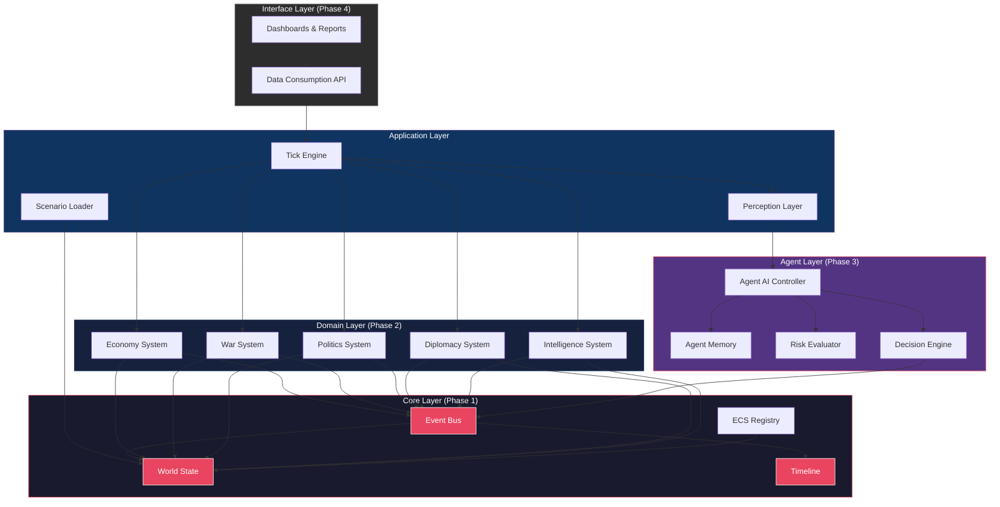
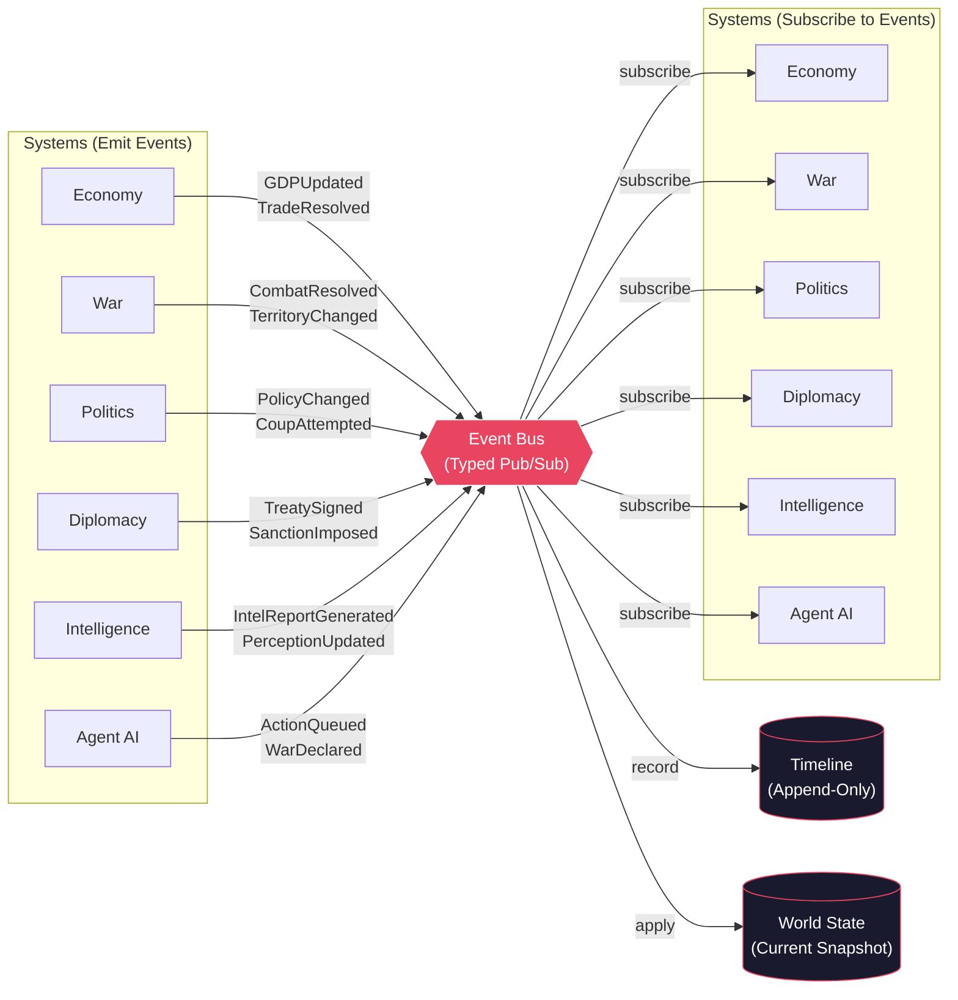

# GeoPolis Engine — Module Map

> **Phase 0 — Step 2**  
> **Version:** 1.0  
> **Date:** 2026-07-24  
> **Status:** Draft — Pending Review

---

## Architecture Overview

The GeoPolis Engine follows a layered Clean Architecture where all cross-module communication flows exclusively through the Event Bus. No domain system has direct knowledge of any other domain system.

---

## Layer Diagram (Clean Architecture Rings)



---

## Event Bus Communication Flow



---

## Tick Execution Pipeline

```mermaid
sequenceDiagram
    participant TE as Tick Engine
    participant WS as World State
    participant SYS as Systems (Priority Order)
    participant EB as Event Bus
    participant TL as Timeline
    participant PL as Perception Layer
    participant AI as Agent AI

    TE->>TE: Begin Tick N
    
    rect rgb(26, 26, 46)
        Note over TE,AI: Phase 1 — Input Collection
        TE->>WS: Collect queued actions
        TE->>TE: Validate action legality
    end

    rect rgb(22, 33, 62)
        Note over TE,AI: Phase 2 — System Execution
        loop For each System (by priority)
            TE->>SYS: Execute system
            SYS->>WS: Read current state
            SYS->>EB: Emit events
        end
    end

    rect rgb(15, 52, 96)
        Note over TE,AI: Phase 3 — Event Resolution
        EB->>TL: Record all events (append-only)
        EB->>WS: Apply state mutations
    end

    rect rgb(83, 52, 131)
        Note over TE,AI: Phase 4 — Perception Update
        TE->>PL: Recalculate per-agent visibility
        PL->>WS: Read ground truth
        PL->>PL: Apply fog, delay, noise
    end

    rect rgb(233, 69, 96)
        Note over TE,AI: Phase 5 — Agent Evaluation
        PL->>AI: Deliver perception state
        AI->>AI: Assess & decide
        AI->>EB: Queue actions for Tick N+1
    end

    TE->>TE: End Tick N
```



---

## Module Dependency Matrix

Shows which modules a system **reads from** (via World State) and **reacts to** (via Event Bus subscriptions).

| System | Reads Components | Subscribes To Events From |
|--------|-----------------|--------------------------|
| **Economy** | Region.Resources, Country.Economy, Treaty.TradeTerms | Diplomacy, War, Politics |
| **War** | Unit.*, Region.Terrain, Country.Military | Economy (supply), Politics (war authorization) |
| **Politics** | Country.Politics, Country.Economy (indicators) | Economy, War, Diplomacy |
| **Diplomacy** | Country.Diplomacy, Timeline (historical interactions) | Politics, War, Economy |
| **Intelligence** | Country.Intelligence, Target.* (filtered) | All systems (for perception generation) |
| **Agent AI** | PerceptionState (filtered, not ground truth) | Intelligence (intel reports), all (via perception) |

> **Key constraint:** No system appears in another system's "Reads Components" column. Systems share data **only** through events, never by reading each other's internal components.

---

## File Structure Projection

```
src/
├── core/                          # Core Layer (Phase 1)
│   ├── interfaces/                # All contracts
│   │   ├── event-bus.interface.ts
│   │   ├── world-state.interface.ts
│   │   ├── timeline.interface.ts
│   │   ├── tick-engine.interface.ts
│   │   ├── system.interface.ts
│   │   ├── entity.interface.ts
│   │   ├── component.interface.ts
│   │   ├── state-serializer.interface.ts # ADR-001: Fog of War YAML serialization
│   │   ├── intent-parser.interface.ts    # ADR-001: LLM payload validation (Fail Fast)
│   │   └── world-seed.interface.ts       # ADR-001: Global seed data (July 24, 2026)
│   ├── event-bus/                 # Event Bus implementation
│   ├── world-state/               # World State implementation
│   ├── timeline/                  # Timeline implementation
│   ├── tick-engine/               # Tick Engine implementation
│   └── ecs/                       # ECS Registry
│
├── domain/                        # Domain Layer (Phase 2)
│   ├── economy/
│   │   ├── components/
│   │   ├── systems/
│   │   └── events/
│   ├── war/                                                              # Phase 5 — Advanced Warfare Engine (IN PROGRESS)
│   │   ├── components/
│   │   │   ├── war.components.ts          # MilitaryUnitComponent, LogisticsSupplyComponent
│   │   │   ├── military-detail.component.ts # CountryMilitaryDetailComponent (GFP: manpower, airpower, land, naval, logistics, readiness, morale)
│   │   │   ├── province.components.ts     # Province terrain/occupation state
│   │   │   └── terrain.components.ts      # Terrain modifiers
│   │   ├── systems/
│   │   │   ├── combined-arms.ts           # Pure combat math (logistics, airpower, readiness, morale force multipliers + advantage calculation)
│   │   │   ├── combat.system.ts           # CombatSystem — emits war.combat-resolved, war.casualties-taken, war.exhaustion-increased, war.advantage-shifted
│   │   │   ├── movement.system.ts         # Unit movement system
│   │   │   ├── occupation.system.ts       # Territory occupation system
│   │   │   ├── occupation-progress.system.ts # Occupation progress tracking
│   │   │   ├── province-combat.system.ts  # Province-level combat resolution
│   │   │   ├── frontline.system.ts        # Frontline management
│   │   │   ├── supply.system.ts           # Supply line management
│   │   │   ├── peace.system.ts            # Peace negotiations
│   │   │   └── war.system.ts              # War declaration/escalation
│   │   └── events/
│   │       └── war.events.ts             # war.combat-resolved, war.casualties-taken, war.exhaustion-increased, war.advantage-shifted, war.peace-signed
│   ├── politics/
│   │   ├── components/
│   │   │   ├── politics.components.ts      # GovernmentStabilityComponent, PoliticalFactionComponent
│   │   │   └── war-exhaustion.component.ts # WarExhaustionComponent (0-100 exhaustion, casualties, ticks at war)
│   │   ├── systems/
│   │   │   ├── politics.system.ts         # Political stability processing
│   │   │   └── coup.system.ts             # Coup d'état mechanics
│   │   └── events/
│   ├── diplomacy/
│   │   ├── components/
│   │   ├── systems/
│   │   └── events/
│   └── intelligence/
│       ├── components/
│       ├── systems/
│       └── events/
│
├── agents/                        # Agent Layer (Phase 3)
│   ├── controller/
│   ├── memory/
│   ├── perception/
│   └── decision/
│
├── application/                   # Application Layer
│   ├── tick-runner/
│   ├── scenario-loader/
│   └── perception-layer/
│
└── interface/                     # Interface Layer (Phase 4)
    ├── api/
    └── reports/
```
